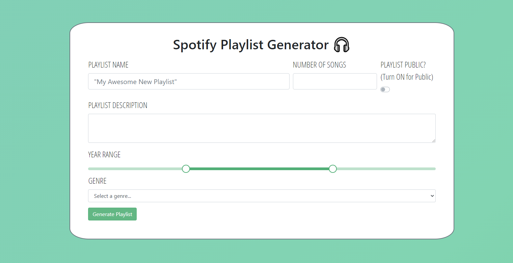

# Spotify Playlist Generator

An application used to generate a brand new playlist in Spotify based on genre
and year range.

## Project Screenshots



## Installation and Setup Instructions

Clone down this repository. You will need `node` and `npm` installed globally on
your machine. **Install dependencies and start server:**

```sh
npm i
npm start
```

**To visit app:** Navigate to `http://localhost:3000/`

## Upcoming Features

### MVP

[ ] Debug the part of application that sends user to different page to
authenticate - automatically reroute back to localhost:3000

[ ] Add alerts to let user know their playlist has successfully been created
(with hyperlinked URL that they can click on to see it in Spotify), or when
there are errors with their input / the server

[ ] Add information on how to host the application locally (npm install, npm
start, etc) to README

[ ] Remove miscellaneous files, console.logs, and boilerplate...

[ ] Deploy application on Heroku so that everyone can use it!

### Stretch Goals

[ ] Add additional genres [ ] Add the green color to list of Bootstrap theme
colors for reusability
