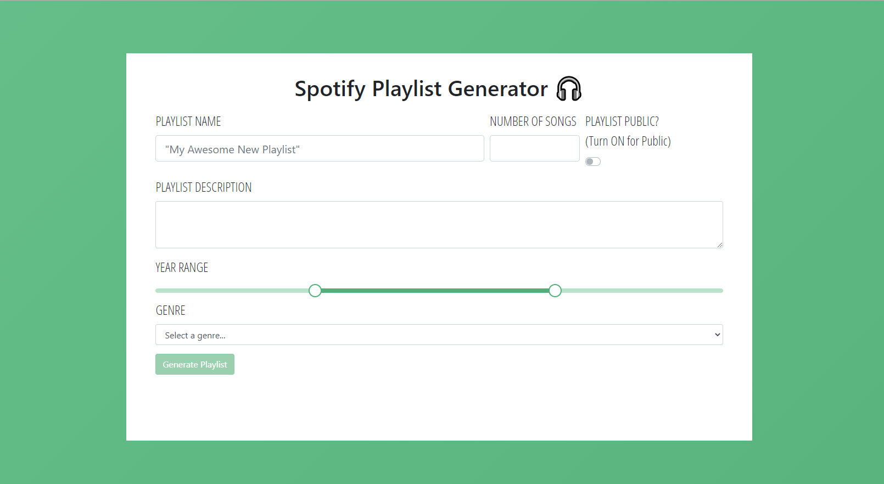

# Spotify Playlist Generator

An application used to generate a brand new playlist in Spotify based on genre
and year range.

## Project Screenshots




## Installation and Setup Instructions

Clone down this repository. You will need `node` and `npm` installed globally on
your machine. **Install dependencies and start server:**

```sh
cd ./client/
npm i
npm start
```

**To visit app:** Navigate to `http://localhost:3000/`

## Upcoming Features

[ ] Add the green color to list of Bootstrap theme colors for reusability [ ]
Receive code review
